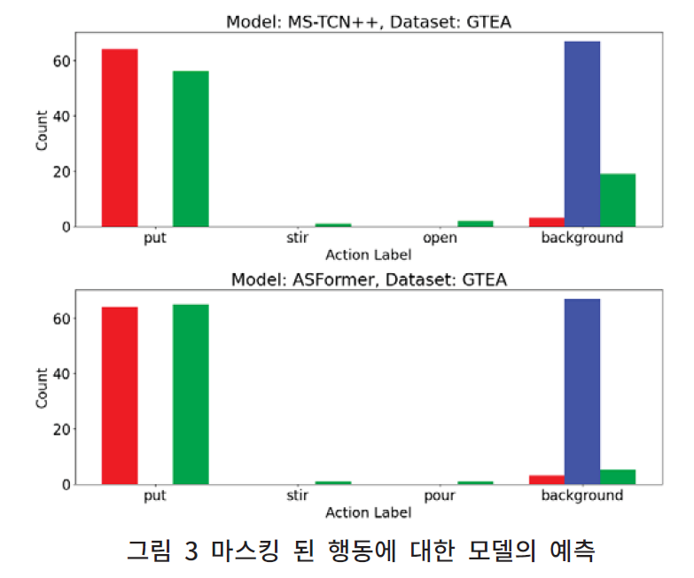

## Official Repository for **Exploring Ordinal Bias in Action Recognition for Instructional Videos**

to be appeared at **ICLRW 2025**,  [**KSC 2023**](https://www.dbpia.co.kr/journal/articleDetail?nodeId=NODE11705159), [**Master Thesis**](https://snu-primo.hosted.exlibrisgroup.com/primo-explore/fulldisplay?docid=82SNU_INST51953513730002591&context=L&vid=82SNU&lang=ko_KR&search_scope=THESIS&adaptor=Local%20Search%20Engine&tab=thesis&query=creator,contains,%EA%B9%80%EC%A3%BC%EC%B0%AC,AND&mode=advanced&offset=0)

This repository only contains video modification and sample visualization code. Refer to each model repository for train and inference.

## Setup
`pip install numpy tqdm setuptools`

## Data
1. Download Features of 50salads, GTEA and Breakfast provided by [ASFormer](https://github.com/ChinaYi/ASFormer) and [MS-TCN](https://github.com/yabufarha/ms-tcn).
2. Unzip the data, rename it to "data" and put into the current directory

## Run
`python main.py --dataset {gtea/breakfast/50salads} --mode {blank/mask,all} --seed {seed} --name {name}`

## Evaluate (Visualize)
Use `visualize.ipynb` by changing directories in shell 2, and 3

## Output
./data_{name}

## Result
### Modification Example

### Quantitative Result

### Qualitative Result


## Cite
```
Joochan Kim, Minjoon Jung, & Byoung-Tak Zhang (2023-12-20). Exploring Bias in Action Understanding Task for Comprehending Instructional Videos. 한국정보과학회 학술발표논문집, 부산.
```

## Acknowledgement
Datasets
1. [GTEA](https://cbs.ic.gatech.edu/fpv/)
2. [50Salads](https://cvip.computing.dundee.ac.uk/datasets/foodpreparation/50salads/)
3. [Breakfast](https://serre-lab.clps.brown.edu/resource/breakfast-actions-dataset/)

Models
1. [ASFormer](https://github.com/ChinaYi/ASFormer)
2. [MS-TCN](https://github.com/yabufarha/ms-tcn)
3. [MS-TCN++](https://github.com/sj-li/MS-TCN2)
4. [DiffAct](https://github.com/Finspire13/DiffAct)
